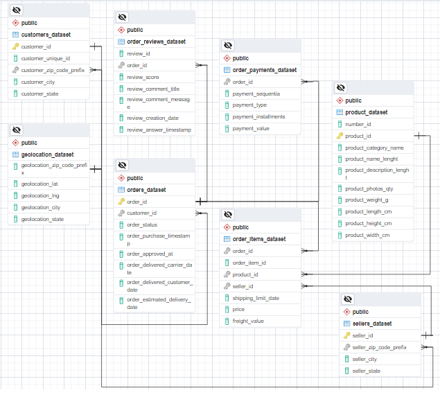

# Analyzing-eCommerce-Business-Performance-with-SQL
Project ini dibuat untuk menganalisis kasus performansi bisnis eCommerce.<br>
**Dataset** : Disediakan oleh Rakamin Academy <br>
**Tools** : PostgreSQL <br>
**Visualization** : Google Data Studio <br>

## Overview
Dalam suatu perusahaan, mengukur performa bisnis sangatlah penting untuk melacak, memantau, dan menilai keberhasilan atau kegagalan dari berbagai proses bisnis. Oleh karena itu, dalam project ini akan menganalisa performa bisnis untuk sebuah perusahan eCommerce,  dengan memperhitungkan beberapa metrik bisnis yaitu: <br>
1. Annual Customer Activity Growth <br>
2. Annual Product Category Quality <br>
3. Annual Payment Type Usage <br>

## Data Preparation
Sebelum memulai pemrosesan data, tahap paling awal yang harus dilakukan adalah mempersiapkan data mentah menjadi data yang terstruktur dan siap diolah. <br>
Dataset yang digunakan adalah dataset semua pemesanan dari sebuah perusahaan e-Commerce dari tahun 2016 – 2018. Di dalam dataset ini terdapat 8 tabel yang berinteraksi satu sama lain. Maka langkah-langkah yang dilakukan selanjutnya adalah sebagai berikut: <br>
1. Buat database baru beserta tabel-tabelnya untuk data yang sudah disiapkan, dengan memperhatikan tipe data masing-masing kolom. <br>
2. Impor data CSV ke database. <br>
3. Menentukan Primary Key dan Foreign Key dengan alter table. <br>
4. Membuat dan mengeksport ERD (Entity Relationship Diagram). <br>

<details>
  <summary>Click untuk melihat Queries</summary>
  
  ``` sql
  -- 1. Membuat tabel
CREATE TABLE customers_dataset (
	customer_id varchar,
	customer_unique_id varchar,
	customer_zip_code_prefix varchar,
	customer_city varchar,
	customer_state varchar
	);
	
CREATE TABLE sellers_dataset (
	seller_id varchar,
	seller_zip_code_prefix varchar,
	seller_city varchar,
	seller_state varchar
	);
	
CREATE TABLE geolocation_dataset (
	geolocation_zip_code_prefix int,
	geolocation_lat decimal,
	geolocation_lng decimal,
	geolocation_city varchar,
	geolocation_state varchar
	);
	
CREATE TABLE product_dataset (
	no_id int,
	product_id varchar,
	product_category_name varchar,
	product_name_lenght double precision,
	product_description_lenght double precision,
	product_photos_qty double precision,
	product_weight_g double precision,
	product_length_cm double precision,
	product_height_cm double precision,
	product_width_cm double precision
	);
	
CREATE TABLE orders_dataset (
	order_id varchar,
	customer_id varchar,
	order_status varchar,
	order_purchase_timestamp timestamp,
	order_approved_at timestamp,
	order_delivered_carrier_date timestamp,
	order_delivered_customer_date timestamp,
	order_estimated_delivery_date timestamp
	);
	
CREATE TABLE order_items_dataset (
	order_id varchar,
	order_item_id int,
	product_id varchar,
	seller_id varchar,
	shipping_limit_date timestamp,
	price decimal,
	fright_value decimal
	);
	
CREATE TABLE order_payments_dataset (
	order_id varchar,
	payment_sequential int,
	payment_type varchar,
	payment_installments int,
	payment_value decimal
	);
	
CREATE TABLE order_reviews_dataset (
	review_id varchar,
	order_id varchar,
	review_score int,
	review_comment_title varchar,
	review_comment_message varchar,
	review_creation_date timestamp,
	review_answer_timestamp timestamp
	);
	
-- 2. Menginput isi tabel dengan file csv, klik kanan pada nama tabel > Import/Export Data


-- 3. Menentukan Primary Key dan Foreign Key
-- Primary Key
alter table customers_dataset add primary key(customer_id);
alter table sellers_dataset add primary key(seller_id);
alter table product_dataset add primary key(product_id);
alter table orders_dataset add primary key(order_id);

-- Foregin Key
alter table orders_dataset add foreign key (customer_id) references customers_dataset;
alter table order_payments_dataset add foreign key (order_id) references orders_dataset;
alter table order_reviews_dataset add foreign key (order_id) references orders_dataset;
alter table order_items_dataset add foreign key (order_id) references orders_dataset;
alter table order_items_dataset add foreign key (product_id) references product_dataset;
alter table order_items_dataset add foreign key (seller_id) references sellers_dataset;

-- 4. Membuat ERD dengan cara klik kanan pada database ecommerce > Generate ERD
```
</details>

**Hasil ERD :** <br>
<p align="center">
  <kbd> </kbd> <br>
  Gambar 1. Entity Relationship Diagram
</p>
<br>

## Data Analysis
## 1. Annual Customer Activity Growth
Pertumbuhan aktivitas customer tahunan dapat dianalisis dari Monthly active user (MAU) atau rata-rata customer aktif bulanan, customer baru, customer dengan repeat order, dan rata-rata order oleh customer.

<details>
  <summary>Click untuk melihat Queries</summary>

  ```sql
-- 1. rata-rata jumlah customer aktif bulanan (monthly active user) untuk setiap tahun
select tahun, round(avg(total_customer)) as rata2_customer_aktif
from (
	  select date_part('year', od.order_purchase_timestamp) as tahun,
		     date_part('month', od.order_purchase_timestamp) as bulan,
	         count(distinct cd.customer_unique_id) as total_customer
	  from orders_dataset as od
	  join customers_dataset as cd
	  on od.customer_id = cd.customer_id
	  group by 1, 2
      ) as tabel_a
group by 1
order by 1;

-- 2. Jumlah customer baru pada masing-masing tahun
select tahun, count(customer_unique_id) as total_customer_baru
from (
	   select min(date_part('year', od.order_purchase_timestamp)) as tahun,
	          cd.customer_unique_id
	   from orders_dataset as od
	   join customers_dataset as cd
	   on od.customer_id = cd.customer_id
	   group by 2
	  ) as tabel_a
group by 1
order by 1;

-- 3. jumlah customer yang melakukan pembelian lebih dari satu kali (repeat order) pada masing-masing tahun
select tahun, count(customer_unique_id) as total_cust_repeat_order
from (
	  select date_part('year', od.order_purchase_timestamp) as tahun,
 	         cd.customer_unique_id,
 		     count(od.order_id) as total_order
	  from orders_dataset as od
	  join customers_dataset as cd
	  on od.customer_id = cd.customer_id
	  group by 1, 2
	  having count(2) > 1
	 ) as tabel_a
group by 1
order by 1;

-- 4. rata-rata jumlah order yang dilakukan customer untuk masing-masing tahun
select tahun, round(avg(total_order), 2) as rata2_frekuensi_order
from (
	  select date_part('year', od.order_purchase_timestamp) as tahun,
 	         cd.customer_unique_id,
 		     count(distinct order_id) as total_order
	  from orders_dataset as od
	  join customers_dataset as cd
	  on od.customer_id = cd.customer_id
	  group by 1, 2
	 ) as tabel_a
group by 1
order by 1;

-- 5. Menggabungkan ketiga metrik yang telah berhasil ditampilkan menjadi satu tampilan tabel
with tbl_mau as (
		    select tahun, round(avg(total_customer)) as rata2_customer_aktif
		    from (
			  select date_part('year', od.order_purchase_timestamp) as tahun,
				 date_part('month', od.order_purchase_timestamp) as bulan,
				 count(distinct cd.customer_unique_id) as total_customer
			  from orders_dataset as od
			  join customers_dataset as cd
			  on od.customer_id = cd.customer_id
			  group by 1, 2
			   ) as tabel_a
		    group by 1
		    order by 1
		     ),
				
tbl_new_cust as (
		    select tahun, count(customer_unique_id) as total_customer_baru
		    from (
			  select min(date_part('year', od.order_purchase_timestamp)) as tahun,
				 cd.customer_unique_id
			  from orders_dataset as od
		 	  join customers_dataset as cd
			  on od.customer_id = cd.customer_id
			  group by 2
			  ) as tabel_a
		    group by 1
		    order by 1),
			
tbl_repeat_order as (
		 	select tahun, count(customer_unique_id) as total_cust_repeat_order
			from (
				select date_part('year', od.order_purchase_timestamp) as tahun,
					cd.customer_unique_id,
					count(od.order_id) as total_order
				from orders_dataset as od
				join customers_dataset as cd
				on od.customer_id = cd.customer_id
				group by 1, 2
				having count(2) > 1
				) as tabel_a
			group by 1
			order by 1),
					
tbl_avg_order as (
		      select tahun, round(avg(total_order), 2) as rata2_frekuensi_order
		      from (
			    select date_part('year', od.order_purchase_timestamp) as tahun,
				   cd.customer_unique_id,
				   count(distinct order_id) as total_order
			    from orders_dataset as od
			    join customers_dataset as cd
			    on od.customer_id = cd.customer_id
			    group by 1, 2
			    ) as tabel_a
		      group by 1
		      order by 1)
				
select t_mau.tahun as tahun,
	  rata2_customer_aktif,
	  total_customer_baru,
	  total_cust_repeat_order,
	  rata2_frekuensi_order
from 
	 tbl_mau as t_mau
	 join
	 	tbl_new_cust as tnc on t_mau.tahun = tnc.tahun
	 join
	 	tbl_repeat_order as tro on tnc.tahun = tro.tahun
	 join
	 	tbl_avg_order as tao on tro.tahun = tao.tahun
group by 1, 2, 3, 4, 5
order by 1;
```
</details>

<p align="center">
Tabel 1. Hasil Analisis Pertumbuhan Aktivitas Pelanggan Tahunan  <br>
  <kbd> </kbd> <br>
</p>

<br>
<p align="center">
  <kbd> </kbd> <br>
  Gambar 2. Grafik Rata-rata MAU dan Pelanggan Baru
</p>

Secara keseluruhan perusahaan mengalami peningkakatan Customer Aktif Bulanan serta customer baru setiap tahunnya. Peningkatan yang signifikan terjadi pada tahun 2016 ke 2017, hal ini dikarenakan data transaksi pada tahun 2016 dimulai pada bulan September. <br>
<br>
<p align="center">
  <kbd> </kbd> <br>
  Gambar 3. Grafik Jumlah Pelanggan yang Melakukan Repeat Order
</p>

Peningkatan yang signifikan juga terjadi pada jumlah customer yang melakukan repeat order pada tahun 2016 hingga 2017. Namun pada tahun 2018 mengalami sedikit penurunan. <br>
<br>

<p align="center">
  <kbd> </kbd> <br>
  Gambar 4. Grafik Rata-rata Frekuensi Order Pelanggan
</p>

Berdasarkan hasil grafik diatas, diketahui bahwa rata-rata customer setiap tahunnya cenderung hanya melakukan order satu kali, artinya mayoritas customer tidak melakukan repeat order.


