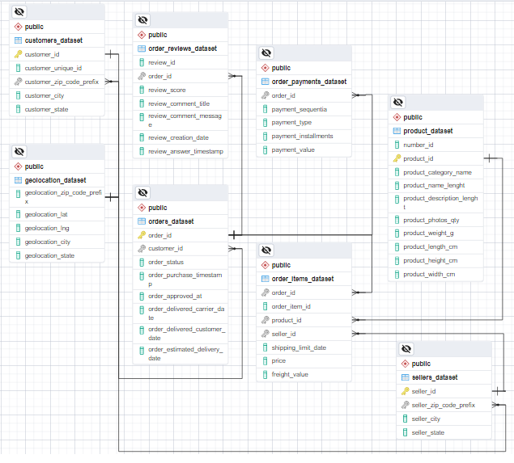

# Analyzing-eCommerce-Business-Performance-with-SQL
This project was created to analyze the business performance of an e-commerce company.<br>
**Dataset** : Provided by Rakamin Academy <br>
**Tools** : PostgreSQL <br>
**Visualization** : Google Data Studio <br>

## Overview
For any company, measuring business performance is important to track and evaluate the success of different business processes. Therefore, this project analyzes the performance of an e-commerce company using several key metrics: <br>
1. Annual Customer Activity Growth <br>
2. Annual Product Category Quality <br>
3. Annual Payment Type Usage <br>

## Data Preparation
Before processing the data, the raw data needs to be prepared and organized into a structured format. <br>
The dataset contains all orders from an e-commerce company from 2016 to 2018. It consists of eight related tables. The data preparation process includes the following steps: <br>
1. Create a new database and tables for the prepared data, with the correct data type for each column. <br>
2. Import the CSV files into the database. <br>
3. Define the Primary Keys and Foreign Keys using the `ALTER TABLE` command. <br>
4. Create and export an ERD (Entity Relationship Diagram). <br>

<details>
  <summary>Click untuk melihat Queries</summary>
  
  ``` sql
  -- 1. Create tabel
CREATE TABLE customers_dataset (
	customer_id varchar,
	customer_unique_id varchar,
	customer_zip_code_prefix varchar,
	customer_city varchar,
	customer_state varchar
	);
	
CREATE TABLE sellers_dataset (
	seller_id varchar,
	seller_zip_code_prefix varchar,
	seller_city varchar,
	seller_state varchar
	);
	
CREATE TABLE geolocation_dataset (
	geolocation_zip_code_prefix int,
	geolocation_lat decimal,
	geolocation_lng decimal,
	geolocation_city varchar,
	geolocation_state varchar
	);
	
CREATE TABLE product_dataset (
	no_id int,
	product_id varchar,
	product_category_name varchar,
	product_name_lenght double precision,
	product_description_lenght double precision,
	product_photos_qty double precision,
	product_weight_g double precision,
	product_length_cm double precision,
	product_height_cm double precision,
	product_width_cm double precision
	);
	
CREATE TABLE orders_dataset (
	order_id varchar,
	customer_id varchar,
	order_status varchar,
	order_purchase_timestamp timestamp,
	order_approved_at timestamp,
	order_delivered_carrier_date timestamp,
	order_delivered_customer_date timestamp,
	order_estimated_delivery_date timestamp
	);
	
CREATE TABLE order_items_dataset (
	order_id varchar,
	order_item_id int,
	product_id varchar,
	seller_id varchar,
	shipping_limit_date timestamp,
	price decimal,
	fright_value decimal
	);
	
CREATE TABLE order_payments_dataset (
	order_id varchar,
	payment_sequential int,
	payment_type varchar,
	payment_installments int,
	payment_value decimal
	);
	
CREATE TABLE order_reviews_dataset (
	review_id varchar,
	order_id varchar,
	review_score int,
	review_comment_title varchar,
	review_comment_message varchar,
	review_creation_date timestamp,
	review_answer_timestamp timestamp
	);
	
-- 2. Import the CSV data into the table by right-clicking the table name > Import/Export Data


-- 3. Define Primary Keys and Foreign Keys
-- Primary Key
alter table customers_dataset add primary key(customer_id);
alter table sellers_dataset add primary key(seller_id);
alter table product_dataset add primary key(product_id);
alter table orders_dataset add primary key(order_id);

-- Foregin Key
alter table orders_dataset add foreign key (customer_id) references customers_dataset;
alter table order_payments_dataset add foreign key (order_id) references orders_dataset;
alter table order_reviews_dataset add foreign key (order_id) references orders_dataset;
alter table order_items_dataset add foreign key (order_id) references orders_dataset;
alter table order_items_dataset add foreign key (product_id) references product_dataset;
alter table order_items_dataset add foreign key (seller_id) references sellers_dataset;

-- 4. Create an ERD by right-clicking on ecommerce database > Generate ERD
```
</details>

**Hasil ERD :** <br>
<p align="center">
  <kbd> </kbd> <br>
  Picture 1. Entity Relationship Diagram
</p>

## Data Analysis
## 1. Annual Customer Activity Growth
Annual customer activity can be analyzed using several metrics, including Monthly Active Users (MAU), new customers, repeat customers, and the average number of orders per customer.

<details>
  <summary>Click untuk melihat Queries</summary>

  ```sql
-- 1. Average number of monthly active users per year
select tahun, round(avg(total_customer)) as rata2_customer_aktif
from (
	  select date_part('year', od.order_purchase_timestamp) as tahun,
		     date_part('month', od.order_purchase_timestamp) as bulan,
	         count(distinct cd.customer_unique_id) as total_customer
	  from orders_dataset as od
	  join customers_dataset as cd
	  on od.customer_id = cd.customer_id
	  group by 1, 2
      ) as tabel_a
group by 1
order by 1;

-- 2. Number of new customers per year
select tahun, count(customer_unique_id) as total_customer_baru
from (
	   select min(date_part('year', od.order_purchase_timestamp)) as tahun,
	          cd.customer_unique_id
	   from orders_dataset as od
	   join customers_dataset as cd
	   on od.customer_id = cd.customer_id
	   group by 2
	  ) as tabel_a
group by 1
order by 1;

-- 3. Number of customers who made repeat purchases per year
select tahun, count(customer_unique_id) as total_cust_repeat_order
from (
	  select date_part('year', od.order_purchase_timestamp) as tahun,
 	         cd.customer_unique_id,
 		     count(od.order_id) as total_order
	  from orders_dataset as od
	  join customers_dataset as cd
	  on od.customer_id = cd.customer_id
	  group by 1, 2
	  having count(2) > 1
	 ) as tabel_a
group by 1
order by 1;

-- 4. Average number of orders placed by customers per year
select tahun, round(avg(total_order), 2) as rata2_frekuensi_order
from (
	  select date_part('year', od.order_purchase_timestamp) as tahun,
 	         cd.customer_unique_id,
 		     count(distinct order_id) as total_order
	  from orders_dataset as od
	  join customers_dataset as cd
	  on od.customer_id = cd.customer_id
	  group by 1, 2
	 ) as tabel_a
group by 1
order by 1;

-- 5. Combining the three metrics into a single table view
with tbl_mau as (
		    select tahun, round(avg(total_customer)) as rata2_customer_aktif
		    from (
			  select date_part('year', od.order_purchase_timestamp) as tahun,
				 date_part('month', od.order_purchase_timestamp) as bulan,
				 count(distinct cd.customer_unique_id) as total_customer
			  from orders_dataset as od
			  join customers_dataset as cd
			  on od.customer_id = cd.customer_id
			  group by 1, 2
			   ) as tabel_a
		    group by 1
		    order by 1
		     ),
				
tbl_new_cust as (
		    select tahun, count(customer_unique_id) as total_customer_baru
		    from (
			  select min(date_part('year', od.order_purchase_timestamp)) as tahun,
				 cd.customer_unique_id
			  from orders_dataset as od
		 	  join customers_dataset as cd
			  on od.customer_id = cd.customer_id
			  group by 2
			  ) as tabel_a
		    group by 1
		    order by 1),
			
tbl_repeat_order as (
		 	select tahun, count(customer_unique_id) as total_cust_repeat_order
			from (
				select date_part('year', od.order_purchase_timestamp) as tahun,
					cd.customer_unique_id,
					count(od.order_id) as total_order
				from orders_dataset as od
				join customers_dataset as cd
				on od.customer_id = cd.customer_id
				group by 1, 2
				having count(2) > 1
				) as tabel_a
			group by 1
			order by 1),
					
tbl_avg_order as (
		      select tahun, round(avg(total_order), 2) as rata2_frekuensi_order
		      from (
			    select date_part('year', od.order_purchase_timestamp) as tahun,
				   cd.customer_unique_id,
				   count(distinct order_id) as total_order
			    from orders_dataset as od
			    join customers_dataset as cd
			    on od.customer_id = cd.customer_id
			    group by 1, 2
			    ) as tabel_a
		      group by 1
		      order by 1)
				
select t_mau.tahun as tahun,
	  rata2_customer_aktif,
	  total_customer_baru,
	  total_cust_repeat_order,
	  rata2_frekuensi_order
from 
	 tbl_mau as t_mau
	 join
	 	tbl_new_cust as tnc on t_mau.tahun = tnc.tahun
	 join
	 	tbl_repeat_order as tro on tnc.tahun = tro.tahun
	 join
	 	tbl_avg_order as tao on tro.tahun = tao.tahun
group by 1, 2, 3, 4, 5
order by 1;
```
</details>

<p align="center">
Tabel 1. Analysis Results of Annual Customer Activity Growth <br>
  <kbd> </kbd> <br>
</p>

<br>
<p align="center">
  <kbd> </kbd> <br>
  Picture 2. Chart of Average MAUs and New Subscribers
</p>

Overall, the company experienced an increase in both monthly active customers and new customers each year. The most significant increase occurred from 2016 to 2017. This was partly because the 2016 transaction data only covered the period from September to December. <br>

<p align="center">
  <kbd> </kbd> <br>
  Picture 3. Chart of the Number of Customers Placing Repeat Orders
</p>

The number of customers who made repeat orders also increased significantly from 2016 to 2017. However, it decreased slightly in 2018. <br>

<p align="center">
  <kbd> </kbd> <br>
  Picture 4. Chart of Average Customer Order Frequency
</p>

Based on the chart above, customers generally made only one order per year on average. This indicates that most customers did not make repeat purchases. <br>

## 2. Annual Product Category Quality
The annual performance of product categories can be analyzed using total revenue, total canceled orders, the top-selling product category, and the category with the most canceled orders.

<details>
  <summary>Click untuk melihat Queries</summary>

  ```sql
-- 1. Create a table showing total company revenue for each year
create table total_revenue as
		select
			  date_part('year', od.order_purchase_timestamp) as tahun,
			  sum(oid.price + oid.freight_value) as revenue
		from order_items_dataset as oid
		join orders_dataset as od on oid.order_id = od.order_id
		where od.order_status = 'delivered'
		group by 1
		order by 1;
		
-- 2. Create a table showing the total number of cancelled orders for each year
create table cancelled_order as
		select
			  date_part('year', order_purchase_timestamp) as tahun,
			  count(order_id) as total_cancel
		from orders_dataset
		where order_status = 'canceled'
		group by 1
		order by 1;
		
-- 3. Create a table showing the product category that generated the highest total revenue for each year
create table top_product_category as
		select
			   tahun,
			   kategori_produk,
			   revenue
		from (
			  select 
					date_part('year', od.order_purchase_timestamp) as tahun,
					pd.product_category_name as kategori_produk,
					sum(oid.price + oid.freight_value) as revenue,
					rank() over(partition by
											date_part('year', od.order_purchase_timestamp) 
									order by 
											sum(oid.price + oid.freight_value) desc) as ranking
			  from order_items_dataset as oid
			  join orders_dataset as od on od.order_id = oid.order_id
			  join product_dataset as pd on pd.product_id = oid.product_id
		   	  where od.order_status = 'delivered'
			  group by 1,2
			  order by 1
			  ) subq
		where ranking = 1;
		
-- 4. Create a table showing the product category with the highest number of cancelled orders for each year
create table top_cancelled_product as
		select
			   tahun,
			   kategori_produk,
			   total_cancel
		from (
			  select 
					date_part('year', od.order_purchase_timestamp) as tahun,
					pd.product_category_name as kategori_produk,
					count(od.order_id) as total_cancel,
					rank() over(partition by
						     date_part('year', od.order_purchase_timestamp) 
					          order by 
			                             count(od.order_id) desc) as ranking
			  from order_items_dataset as oid
			  join orders_dataset as od on od.order_id = oid.order_id
			  join product_dataset as pd on pd.product_id = oid.product_id
		   	  where od.order_status = 'canceled'
			  group by 1,2
			  order by 1
			  ) subq
		where ranking = 1;
		
-- 5. Combine the gathered information into a single table view
select 
        tr.tahun as year,
		round(tr.revenue::numeric, 2) as total_revenue,
		tpc.kategori_produk as top_category_product,
		round(tpc.revenue::numeric, 2) as total_revenue_top_product,
		co.total_cancel,
		tcp.kategori_produk AS top_canceled_product,
		tcp.total_cancel AS total_top_canceled_product
from total_revenue as tr
join
	top_product_category as tpc on tr.tahun = tpc.tahun
join
	cancelled_order as co on tpc.tahun = co.tahun
join
	top_cancelled_product as tcp on co.tahun = tcp.tahun;
```
</details>

<p align="center">
Tabel 2. Analysis Results of Total Annual Product Categories <br>
  <kbd> </kbd> <br>
</p>

<br>
<p align="center">
  <kbd> </kbd> <br>
  Picture 5. Annual Total Revenue Chart
</p>

Overall the company's revenue increases every year. <br>

<p align="center">
  <kbd> </kbd> <br>
  Picture 6. Chart of Total Revenue by Top Products per Year
</p>

Sales of the top product categories increased each year. However, the top-selling category was different each year. In 2018, the highest sales came from (health_beauty) category. <br>

<p align="center">
  <kbd> </kbd> <br>
  Picture 7. Chart of Total Top Cancelled Products per Year
</p>

The category with the most canceled orders also varied each year and showed an overall increase. In 2018, the category with the highest number of canceled products was also Health & Beauty, which was the top-selling category that year. This may indicate that the category had a high level of customer demand and activity. <br>

## 3. Annual Payment Type Usage
Customer payment preferences can be analyzed by looking at the most frequently used payment methods and the number of transactions for each method each year. <br>

<details>
  <summary>Click untuk melihat Queries</summary>

  ```sql
-- 1. Displays the total usage count for each payment type (all-time), sorted by popularity
select payment_type, count(1) as jumlah
from order_payments_dataset
group by 1
order by 2 desc;

-- 2. Displays detailed usage statistics for each payment type on a yearly basis
select
	payment_type,
	sum(case when tahun = 2016 then total else 0 end) as "2016",
	sum(case when tahun = 2017 then total else 0 end) as "2017",
	sum(case when tahun = 2018 then total else 0 end) as "2018",
	sum(total) as total_payment_type_usage
from (
	select 
		date_part('year', od.order_purchase_timestamp) as tahun,
		opd.payment_type,
		count(opd.payment_type) as total
	from orders_dataset as od
	join order_payments_dataset as opd 
		on od.order_id = opd.order_id
	group by 1, 2
	) as sub
group by 1
order by 2 desc;
```
</details>

<p align="center">
Tabel 3. Analysis of Payment Types Used by Customers <br>
  <kbd> </kbd> <br>
</p>

<br>
<p align="center">
  <kbd> </kbd> <br>
  Picture 8. Chart of Payment Types Used by Customers (Yearly)
</p>

- Credit cards were the most commonly used payment method, and their usage increased each year. <br>

- Vouchers became more popular in 2017 but declined in 2018. This may have been related to fewer vouchers being issued by the company compared to the previous year. <br>

- Debit card usage increased significantly in 2018. This may have been influenced by payment discounts or promotions available for debit card users, which could have encouraged more customers to use this payment method.<br>

Overall credit cards remained the most popular payment method, while debit card usage showed significant growth in 2018.


